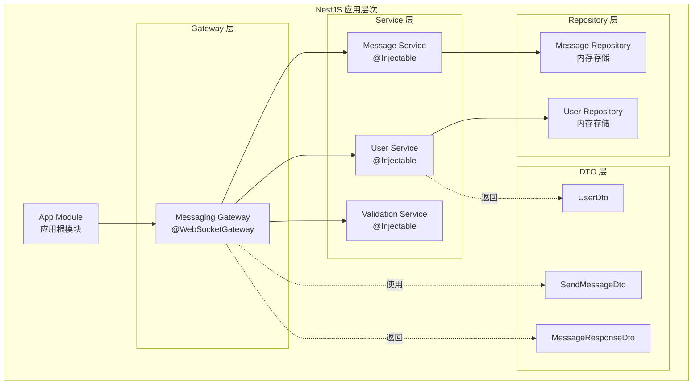
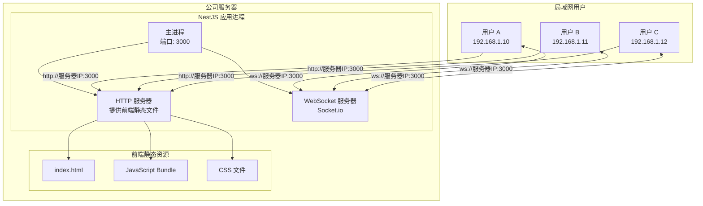
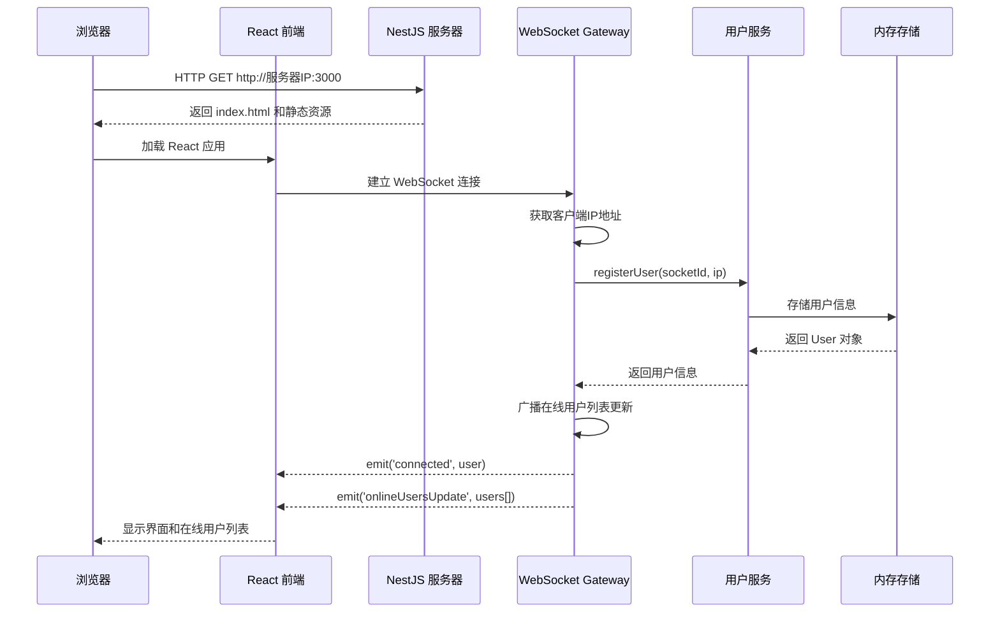
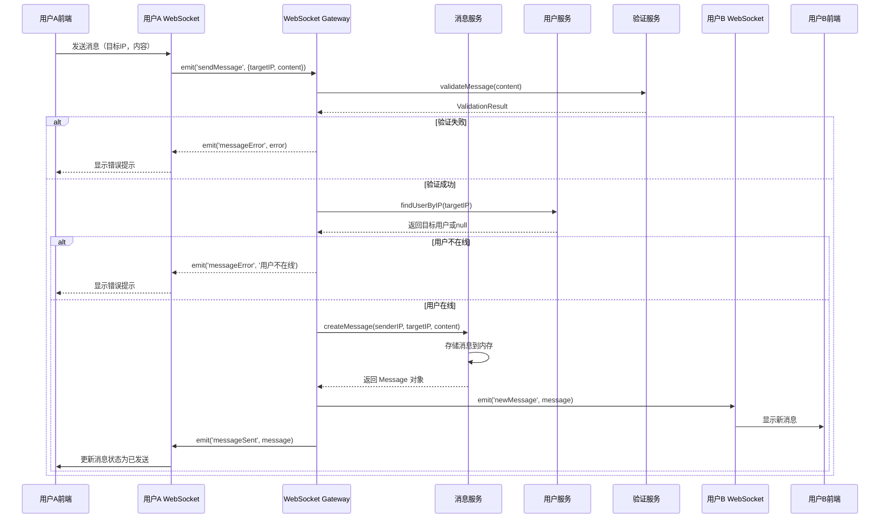
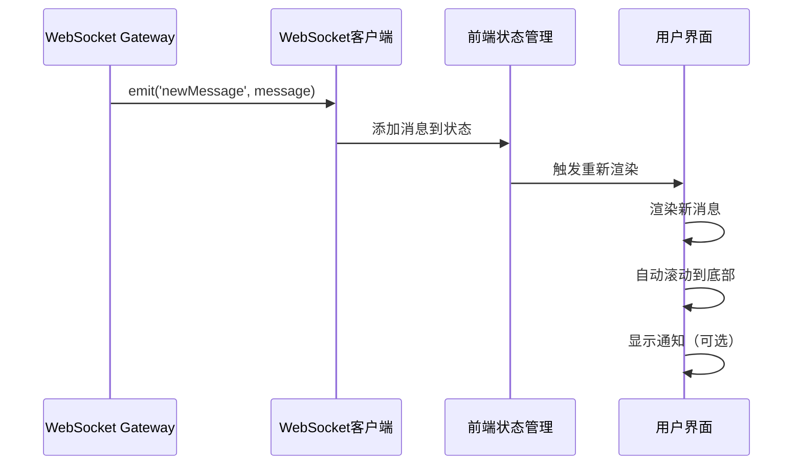
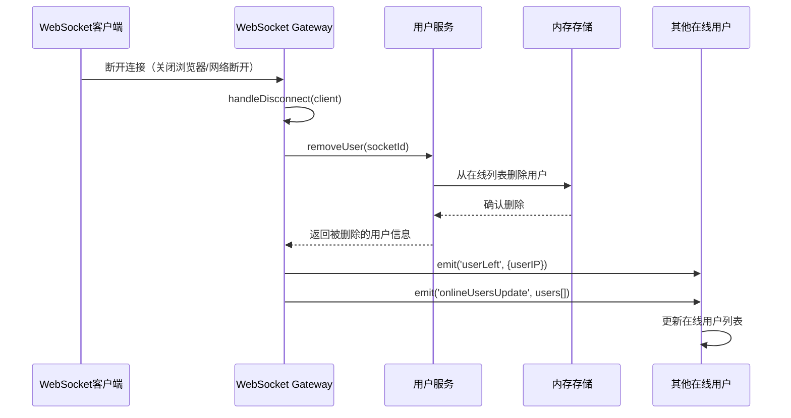
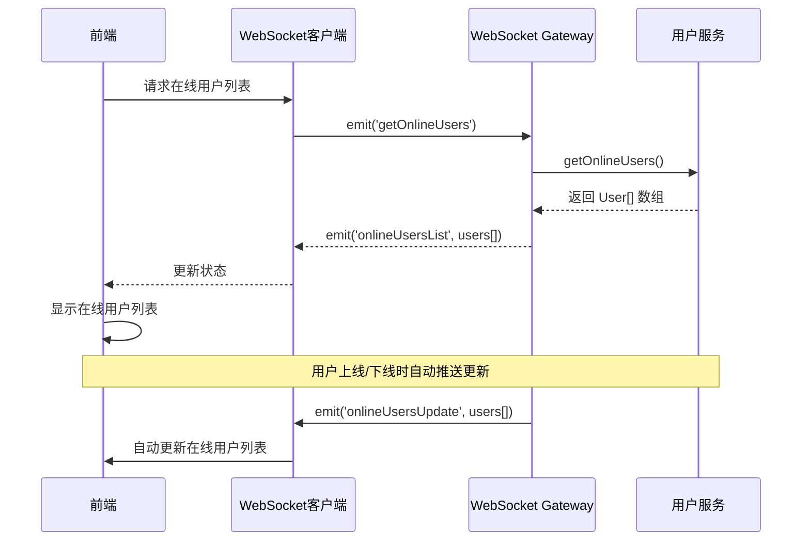
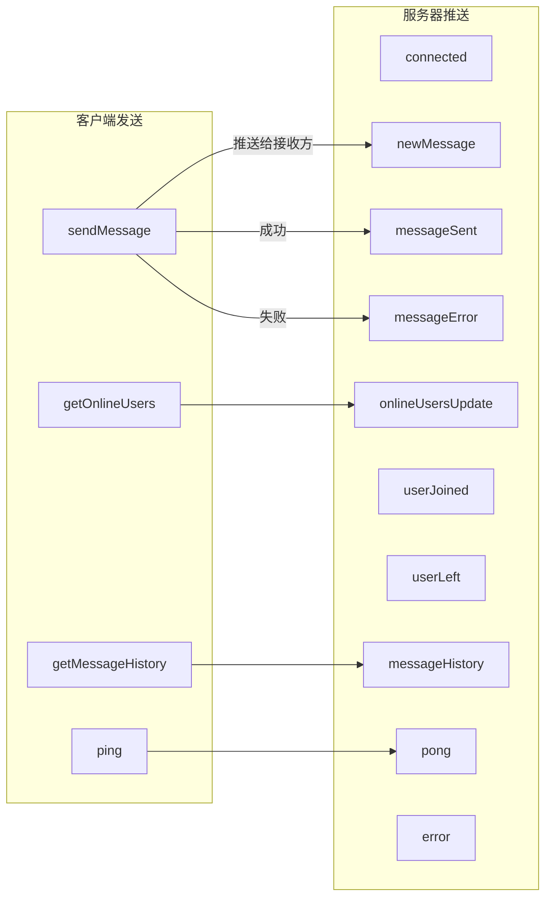

# 设计文档

## 概述

局域网消息应用是一个基于Web的实时消息系统，采用中央服务器架构。应用部署在公司服务器上，用户通过浏览器访问服务器IP地址即可使用。后端使用NestJS框架作为消息中转站，维护在线用户列表，通过WebSocket（Socket.io）实现实时双向通信和消息推送。

### 核心功能

- 中央服务器消息中转和路由
- 在线用户列表实时维护和同步
- WebSocket实时消息推送和接收
- 消息历史记录存储和查询
- 用户IP地址自动识别和显示
- 设备发现（显示在线用户列表）
- 输入验证和错误处理
- 响应式跨平台界面

### 技术栈

- **前端框架**: React + TypeScript
- **UI库**: Tailwind CSS（响应式设计）
- **后端框架**: NestJS + TypeScript
- **WebSocket库**: @nestjs/websockets + Socket.io
- **通信协议**: WebSocket（Socket.io）
- **数据存储**: 内存存储（在线用户和消息历史）
- **状态管理**: React Context API 或 Zustand
- **HTTP服务器**: NestJS内置（Express或Fastify）
- **部署方式**: 公司服务器部署，用户通过 http://服务器IP:端口 访问

### 设计原则

1. **中央化**: NestJS服务器作为消息中转站，统一管理用户连接和消息路由
2. **简洁性**: 单页面应用，所有功能一目了然
3. **响应式**: 适配移动端、平板和桌面设备
4. **实时性**: WebSocket双向通信实现消息即时推送
5. **容错性**: 优雅处理网络错误、连接失败和重连
6. **可维护性**: NestJS模块化架构，依赖注入，易于扩展和维护
7. **可扩展性**: 模块化设计支持未来功能扩展（如房间、文件传输等）

## 架构

### 系统架构

```mermaid
graph TB
    subgraph "用户设备 A"
        A1[浏览器 - React 前端]
        A2[Socket.io 客户端]
    end
    
    subgraph "用户设备 B"
        B1[浏览器 - React 前端]
        B2[Socket.io 客户端]
    end
    
    subgraph "用户设备 C"
        C1[浏览器 - React 前端]
        C2[Socket.io 客户端]
    end
    
    subgraph "公司服务器"
        direction TB
        S1[NestJS 应用<br/>HTTP + WebSocket]
        S2[WebSocket Gateway<br/>连接管理]
        S3[消息服务<br/>消息路由和存储]
        S4[用户管理服务<br/>在线用户维护]
        S5[验证服务<br/>输入验证]
        
        subgraph "内存存储"
            M1[在线用户Map<br/>socketId -> User]
            M2[消息历史数组<br/>Message[]]
        end
        
        S1 --> S2
        S2 --> S3
        S2 --> S4
        S2 --> S5
        S3 --> M2
        S4 --> M1
    end
    
    A2 <-->|WebSocket<br/>双向通信| S2
    B2 <-->|WebSocket<br/>双向通信| S2
    C2 <-->|WebSocket<br/>双向通信| S2
    A1 -->|HTTP<br/>静态资源| S1
    B1 -->|HTTP<br/>静态资源| S1
    C1 -->|HTTP<br/>静态资源| S1
    A1 --> A2
    B1 --> B2
    C1 --> C2
```

### NestJS 模块架构



### 部署架构



### 通信流程

**用户连接流程:**


**发送消息流程:**


**接收消息流程:**


**用户断开连接流程:**


**设备发现流程（在线用户列表）:**


## 组件和接口

### 前端组件

#### 1. App 组件
主应用容器，管理全局状态和WebSocket连接。

```typescript
interface AppState {
  currentUser: User | null;
  connectionStatus: 'connecting' | 'connected' | 'disconnected';
  messages: Message[];
  onlineUsers: User[];
}
```

#### 2. MessageInput 组件
消息输入区域，包含目标用户选择和消息内容输入。

```typescript
interface MessageInputProps {
  onSendMessage: (targetUserIP: string, content: string) => Promise<void>;
  onlineUsers: User[];
  isConnected: boolean;
}
```

#### 3. MessageList 组件
显示消息历史记录。

```typescript
interface MessageListProps {
  messages: Message[];
  currentUserIP: string;
}
```

#### 4. OnlineUserList 组件
显示在线用户列表。

```typescript
interface OnlineUserListProps {
  users: User[];
  currentUserIP: string;
  onSelectUser: (user: User) => void;
}
```

#### 5. ConnectionStatus 组件
显示WebSocket连接状态。

```typescript
interface ConnectionStatusProps {
  status: 'connecting' | 'connected' | 'disconnected';
  currentUserIP: string;
  onCopyIP: () => void;
  onReconnect: () => void;
}
```

### 后端 NestJS 模块

#### 1. Messaging Gateway（WebSocket网关）

NestJS的WebSocket Gateway负责处理所有WebSocket连接和事件。

```typescript
@WebSocketGateway({
  cors: {
    origin: '*', // 生产环境应限制为特定域名
  },
})
export class MessagingGateway implements OnGatewayConnection, OnGatewayDisconnect {
  constructor(
    private readonly messageService: MessageService,
    private readonly userService: UserService,
    private readonly validationService: ValidationService,
  ) {}

  @WebSocketServer()
  server: Server;

  // 处理客户端连接
  async handleConnection(client: Socket): Promise<void>;
  
  // 处理客户端断开
  async handleDisconnect(client: Socket): Promise<void>;
  
  // 处理发送消息事件
  @SubscribeMessage('sendMessage')
  async handleSendMessage(
    @ConnectedSocket() client: Socket,
    @MessageBody() payload: SendMessageDto,
  ): Promise<WsResponse<MessageResponse>>;
  
  // 处理获取在线用户事件
  @SubscribeMessage('getOnlineUsers')
  handleGetOnlineUsers(
    @ConnectedSocket() client: Socket,
  ): WsResponse<User[]>;
  
  // 处理获取消息历史事件
  @SubscribeMessage('getMessageHistory')
  handleGetMessageHistory(
    @ConnectedSocket() client: Socket,
    @MessageBody() payload: { targetIP?: string; limit?: number },
  ): WsResponse<Message[]>;
  
  // 推送消息到特定用户（内部方法）
  private sendMessageToUser(targetSocketId: string, message: Message): void;
  
  // 广播在线用户列表更新（内部方法）
  private broadcastOnlineUsers(): void;
  
  // 广播用户上线通知（内部方法）
  private broadcastUserJoined(user: User): void;
  
  // 广播用户下线通知（内部方法）
  private broadcastUserLeft(userIP: string): void;
  
  // 获取客户端IP地址（内部方法）
  private getClientIP(client: Socket): string;
}
```

#### 2. Message Service（消息服务）

```typescript
@Injectable()
export class MessageService {
  constructor(private readonly messageRepository: MessageRepository) {}

  // 创建新消息
  createMessage(
    senderIP: string,
    receiverIP: string,
    content: string,
  ): Message;
  
  // 获取消息历史（所有消息）
  getMessageHistory(limit?: number): Message[];
  
  // 获取特定用户的消息历史
  getUserMessageHistory(userIP: string, limit?: number): Message[];
  
  // 获取两个用户之间的对话
  getConversation(userIP1: string, userIP2: string, limit?: number): Message[];
  
  // 存储消息
  saveMessage(message: Message): void;
  
  // 清理旧消息（当消息数量超过限制时）
  cleanupOldMessages(maxMessages: number): void;
  
  // 获取消息统计
  getMessageStats(): {
    totalMessages: number;
    messagesInLastHour: number;
  };
}
```

#### 3. User Service（用户服务）

```typescript
@Injectable()
export class UserService {
  constructor(private readonly userRepository: UserRepository) {}

  // 注册新用户连接
  registerUser(socketId: string, ip: string): User;
  
  // 移除用户连接
  removeUser(socketId: string): User | null;
  
  // 获取所有在线用户
  getOnlineUsers(): User[];
  
  // 根据IP查找用户
  findUserByIP(ip: string): User | null;
  
  // 根据Socket ID查找用户
  findUserBySocketId(socketId: string): User | null;
  
  // 更新用户最后活跃时间
  updateUserActivity(socketId: string): void;
  
  // 获取在线用户数量
  getOnlineUserCount(): number;
  
  // 检查用户是否在线
  isUserOnline(ip: string): boolean;
  
  // 清理不活跃用户（可选，用于心跳超时）
  cleanupInactiveUsers(timeoutMs: number): User[];
}
```

#### 4. Validation Service（验证服务）

```typescript
@Injectable()
export class ValidationService {
  // 验证IP地址格式
  validateIPAddress(ip: string): ValidationResult;
  
  // 验证消息内容
  validateMessageContent(content: string): ValidationResult;
  
  // 验证消息长度
  validateMessageLength(content: string, maxLength: number): ValidationResult;
  
  // 综合验证发送消息请求
  validateSendMessageRequest(dto: SendMessageDto): ValidationResult;
  
  // 验证Socket连接
  validateSocketConnection(client: Socket): ValidationResult;
}
```

#### 5. Message Repository（消息仓库）

```typescript
@Injectable()
export class MessageRepository {
  private messages: Message[] = [];
  private readonly maxMessages: number = 1000;

  // 保存消息
  save(message: Message): void;
  
  // 获取所有消息
  findAll(limit?: number): Message[];
  
  // 根据用户IP查找消息
  findByUserIP(userIP: string, limit?: number): Message[];
  
  // 查找两个用户之间的对话
  findConversation(userIP1: string, userIP2: string, limit?: number): Message[];
  
  // 清理旧消息
  cleanup(maxMessages: number): void;
  
  // 获取消息数量
  count(): number;
  
  // 清空所有消息
  clear(): void;
}
```

#### 6. User Repository（用户仓库）

```typescript
@Injectable()
export class UserRepository {
  private users: Map<string, User> = new Map(); // key: socketId, value: User

  // 添加用户
  add(user: User): void;
  
  // 删除用户
  remove(socketId: string): User | null;
  
  // 根据Socket ID查找用户
  findBySocketId(socketId: string): User | null;
  
  // 根据IP查找用户
  findByIP(ip: string): User | null;
  
  // 获取所有用户
  findAll(): User[];
  
  // 更新用户
  update(socketId: string, updates: Partial<User>): User | null;
  
  // 获取用户数量
  count(): number;
  
  // 清空所有用户
  clear(): void;
}
```

#### 7. App Module（应用模块）

```typescript
@Module({
  imports: [],
  controllers: [],
  providers: [
    MessagingGateway,
    MessageService,
    UserService,
    ValidationService,
    MessageRepository,
    UserRepository,
  ],
})
export class AppModule {}
```

### WebSocket 事件定义

#### 客户端发送事件（Client -> Server）

```typescript
// 1. 发送消息
interface SendMessageDto {
  targetIP: string;        // 目标用户IP地址
  content: string;         // 消息内容
}

// 2. 获取在线用户列表
// 事件名: 'getOnlineUsers'
// 无需参数

// 3. 获取消息历史
interface GetMessageHistoryDto {
  targetIP?: string;       // 可选：特定用户的对话历史
  limit?: number;          // 可选：限制返回数量（默认100）
}

// 4. 心跳检测（可选）
// 事件名: 'ping'
// 无需参数
```

#### 服务器推送事件（Server -> Client）

```typescript
// 1. 连接成功通知
interface ConnectedEvent {
  user: User;              // 当前用户信息
  onlineUsers: User[];     // 当前在线用户列表
}

// 2. 新消息通知
interface NewMessageEvent {
  message: Message;        // 消息对象
}

// 3. 消息发送成功确认
interface MessageSentEvent {
  message: Message;        // 已发送的消息对象
}

// 4. 消息发送失败通知
interface MessageErrorEvent {
  error: string;           // 错误信息
  code: 'INVALID_INPUT' | 'USER_OFFLINE' | 'SEND_FAILED' | 'UNKNOWN';
}

// 5. 在线用户列表更新
interface OnlineUsersUpdateEvent {
  users: User[];           // 最新的在线用户列表
}

// 6. 用户上线通知
interface UserJoinedEvent {
  user: User;              // 新上线的用户
}

// 7. 用户下线通知
interface UserLeftEvent {
  userIP: string;          // 下线用户的IP地址
}

// 8. 消息历史响应
interface MessageHistoryEvent {
  messages: Message[];     // 消息历史数组
  total: number;           // 总消息数
}

// 9. 心跳响应（可选）
// 事件名: 'pong'
// 无需参数

// 10. 错误通知
interface ErrorEvent {
  message: string;         // 错误描述
  code?: string;           // 错误代码
}
```

#### WebSocket 事件流程图



## 数据模型

### Message（消息）

```typescript
interface Message {
  id: string;              // 唯一标识符（UUID）
  content: string;         // 消息内容（最大1000字符）
  senderIP: string;        // 发送方IP地址
  receiverIP: string;      // 接收方IP地址
  timestamp: number;       // Unix时间戳（毫秒）
  direction: 'sent' | 'received';  // 消息方向（客户端使用）
  status: 'pending' | 'sent' | 'failed';  // 发送状态
}
```

### User（用户）

```typescript
interface User {
  id: string;              // 用户唯一标识符（Socket ID）
  ip: string;              // 用户IP地址
  socketId: string;        // WebSocket连接ID
  connectedAt: number;     // 连接时间（Unix时间戳）
  lastActivity: number;    // 最后活跃时间（Unix时间戳）
  isOnline: boolean;       // 是否在线
}
```

### ConnectionStatus（连接状态）

```typescript
interface ConnectionStatus {
  status: 'connecting' | 'connected' | 'disconnected';
  connectedAt?: number;    // 连接建立时间
  lastPing?: number;       // 最后心跳时间
  reconnectAttempts?: number; // 重连尝试次数
}
```

### AppConfig（应用配置）

```typescript
interface AppConfig {
  port: number;            // 服务器端口（HTTP和WebSocket共用，默认3000）
  messageTimeout: number;  // 消息发送超时时间（毫秒，默认5000）
  maxMessageLength: number; // 最大消息长度（默认1000）
  maxMessagesInMemory: number; // 内存中保存的最大消息数（默认1000）
  heartbeatInterval: number; // 心跳间隔（毫秒，默认30000）
  reconnectDelay: number;  // 重连延迟（毫秒，默认3000）
  maxReconnectAttempts: number; // 最大重连次数（默认5）
  corsOrigin: string;      // CORS允许的源（生产环境应设置为特定域名）
  staticAssetsPath: string; // 前端静态资源路径（默认'./client/dist'）
}
```

### ValidationResult（验证结果）

```typescript
interface ValidationResult {
  isValid: boolean;        // 是否有效
  error?: string;          // 错误信息
}
```

### SendMessageDto（发送消息DTO）

```typescript
interface SendMessageDto {
  targetIP: string;        // 目标用户IP
  content: string;         // 消息内容
}
```

### MessageResponse（消息响应）

```typescript
interface MessageResponse {
  success: boolean;        // 是否成功
  message?: Message;       // 消息对象（成功时）
  error?: string;          // 错误信息（失败时）
}
```


## 正确性属性

属性是系统所有有效执行中应该保持为真的特征或行为——本质上是关于系统应该做什么的形式化陈述。属性是人类可读规范和机器可验证正确性保证之间的桥梁。

### 属性 1: 消息成功发送到在线用户

对于任意有效的消息内容和任意在线用户的IP地址，当发送消息时，目标用户应该能够接收到该消息，且消息内容、发送方IP和时间戳应该保持一致。

**验证需求: 1.4, 3.1, 3.2**

### 属性 2: 离线用户消息发送失败

对于任意有效的消息内容和任意不在线的IP地址，当尝试发送消息时，系统应该返回错误，指示目标用户不在线。

**验证需求: 1.6**

### 属性 3: 在线用户列表准确性

对于任意时刻，获取在线用户列表应该返回所有当前已连接的用户，且每个用户对象应该包含有效的IP地址和Socket ID。

**验证需求: 2.1, 2.2, 2.3**

### 属性 4: 用户连接和断开的一致性

对于任意用户，当用户建立WebSocket连接时，该用户应该出现在在线列表中；当用户断开连接时，该用户应该从在线列表中移除。

**验证需求: 2.1, 4.1**

### 属性 5: 消息对象完整性

对于任意创建的消息，该消息对象应该包含所有必需字段：唯一ID、内容、发送方IP、接收方IP和时间戳。

**验证需求: 3.3, 3.4, 5.3, 5.4**

### 属性 6: 消息历史持久性

对于任意成功发送的消息，该消息应该被存储在消息历史中，并且可以通过查询消息历史获取。

**验证需求: 5.1, 5.2**

### 属性 7: 消息时间顺序

对于任意消息历史查询，返回的消息数组应该按时间戳升序排列（最早的在前，最新的在后）。

**验证需求: 5.5**

### 属性 8: IP地址格式验证

对于任意字符串，IP地址验证函数应该正确识别有效的IPv4地址格式（例如：192.168.1.1），并拒绝无效格式。

**验证需求: 6.1, 6.2**

### 属性 9: 消息内容验证

对于任意字符串，消息验证函数应该：
- 拒绝空字符串或仅包含空白字符的字符串
- 拒绝长度超过1000字符的字符串
- 接受长度在1-1000字符之间的非空字符串

**验证需求: 6.3, 6.4, 6.5**

### 属性 10: 连接状态一致性

对于任意时刻，前端显示的连接状态应该准确反映WebSocket的实际连接状态（connecting、connected或disconnected）。

**验证需求: 7.1, 7.4**

### 属性 11: 消息发送状态转换

对于任意消息发送操作，消息状态应该遵循以下转换：
- 初始状态为'pending'
- 成功发送后转换为'sent'
- 发送失败后转换为'failed'

**验证需求: 1.5, 8.3**

### 属性 12: 错误后应用可用性

对于任意错误情况（消息发送失败、验证错误、网络错误），应用应该捕获错误、显示适当的错误消息，并保持其他功能可用。

**验证需求: 9.4**

### 属性 13: 用户过滤功能

对于任意在线用户列表和任意搜索字符串，过滤后的结果应该只包含IP地址中包含该搜索字符串的用户。

**验证需求: 2.4**

### 属性 14: 消息往返一致性

对于任意消息对象，将其序列化为JSON后再反序列化，应该得到等价的消息对象（所有字段值相同）。

**验证需求: 数据完整性（隐含）**

## 错误处理

### 错误类型和处理策略

#### 1. WebSocket连接错误

**错误场景:**
- 初始连接失败
- 连接意外断开
- 心跳超时

**处理策略:**
- 显示连接状态为'disconnected'
- 禁用消息发送功能
- 自动尝试重连（最多5次，每次间隔3秒）
- 显示用户友好的错误提示
- 记录错误日志到控制台

**实现位置:**
- 前端: WebSocket客户端连接管理
- 后端: Gateway的handleDisconnect方法

#### 2. 消息发送错误

**错误场景:**
- 目标用户不在线
- 消息内容验证失败
- 网络超时（5秒）
- 服务器内部错误

**处理策略:**
- 返回具体的错误代码和消息
- 将消息状态设置为'failed'
- 在UI中显示错误提示
- 允许用户重试发送
- 不影响其他消息的发送

**实现位置:**
- 前端: 消息发送处理函数
- 后端: Gateway的handleSendMessage方法

#### 3. 输入验证错误

**错误场景:**
- IP地址格式无效
- 消息内容为空
- 消息长度超过1000字符

**处理策略:**
- 在客户端进行即时验证（实时反馈）
- 在服务器端进行二次验证（安全保障）
- 显示具体的验证错误信息
- 禁用发送按钮直到输入有效
- 不发送无效请求到服务器

**实现位置:**
- 前端: 输入组件的验证逻辑
- 后端: ValidationService

#### 4. 数据格式错误

**错误场景:**
- 接收到格式错误的WebSocket消息
- JSON解析失败
- 缺少必需字段

**处理策略:**
- 记录错误但不显示给用户
- 忽略格式错误的消息
- 保持应用继续运行
- 在开发环境中显示详细错误

**实现位置:**
- 前端: WebSocket消息处理器
- 后端: DTO验证管道

#### 5. 内存限制错误

**错误场景:**
- 消息历史超过1000条
- 在线用户数量过多

**处理策略:**
- 自动清理最旧的消息（FIFO）
- 限制消息历史查询数量
- 监控内存使用情况
- 在达到阈值时记录警告

**实现位置:**
- 后端: MessageRepository的cleanup方法
- 后端: 定期清理任务（可选）

#### 6. 未预期错误

**错误场景:**
- 未捕获的异常
- 系统级错误

**处理策略:**
- 使用全局错误边界捕获（前端）
- 使用异常过滤器捕获（后端）
- 显示通用错误提示
- 记录完整错误堆栈
- 尝试恢复应用状态
- 提供刷新页面选项

**实现位置:**
- 前端: React Error Boundary
- 后端: NestJS Exception Filter

### 错误响应格式

所有错误响应应遵循统一格式：

```typescript
interface ErrorResponse {
  success: false;
  error: {
    code: string;           // 错误代码（如'USER_OFFLINE', 'INVALID_INPUT'）
    message: string;        // 用户友好的错误消息
    details?: any;          // 可选的详细信息（仅开发环境）
    timestamp: number;      // 错误发生时间
  };
}
```

### 错误代码定义

```typescript
enum ErrorCode {
  // 连接错误
  CONNECTION_FAILED = 'CONNECTION_FAILED',
  CONNECTION_TIMEOUT = 'CONNECTION_TIMEOUT',
  DISCONNECTED = 'DISCONNECTED',
  
  // 消息错误
  USER_OFFLINE = 'USER_OFFLINE',
  MESSAGE_SEND_FAILED = 'MESSAGE_SEND_FAILED',
  MESSAGE_TIMEOUT = 'MESSAGE_TIMEOUT',
  
  // 验证错误
  INVALID_IP = 'INVALID_IP',
  INVALID_MESSAGE = 'INVALID_MESSAGE',
  MESSAGE_TOO_LONG = 'MESSAGE_TOO_LONG',
  MESSAGE_EMPTY = 'MESSAGE_EMPTY',
  
  // 数据错误
  INVALID_FORMAT = 'INVALID_FORMAT',
  MISSING_FIELD = 'MISSING_FIELD',
  
  // 系统错误
  INTERNAL_ERROR = 'INTERNAL_ERROR',
  UNKNOWN_ERROR = 'UNKNOWN_ERROR',
}
```

## 测试策略

### 测试方法概述

本项目采用双重测试方法，结合单元测试和基于属性的测试（Property-Based Testing, PBT），以确保全面的代码覆盖和正确性验证。

#### 单元测试
- 验证特定示例和边缘情况
- 测试组件集成点
- 测试错误条件和异常处理
- 使用Jest作为测试框架

#### 基于属性的测试
- 验证跨所有输入的通用属性
- 通过随机化实现全面的输入覆盖
- 使用fast-check库（JavaScript/TypeScript的PBT库）
- 每个属性测试最少运行100次迭代

### 后端测试策略（NestJS）

#### 1. Gateway测试

**单元测试:**
- 测试handleConnection正确注册用户
- 测试handleDisconnect正确移除用户
- 测试handleSendMessage的成功和失败场景
- 测试事件广播功能

**属性测试:**
- 属性4: 用户连接和断开的一致性
- 属性2: 离线用户消息发送失败

**测试工具:**
- @nestjs/testing
- socket.io-client（模拟客户端）
- fast-check

#### 2. Service层测试

**MessageService测试:**

单元测试:
- 测试createMessage创建有效消息对象
- 测试getMessageHistory返回正确数量的消息
- 测试getConversation过滤正确的对话
- 测试cleanupOldMessages正确清理

属性测试:
- 属性5: 消息对象完整性
- 属性6: 消息历史持久性
- 属性7: 消息时间顺序
- 属性14: 消息往返一致性

**UserService测试:**

单元测试:
- 测试registerUser创建新用户
- 测试removeUser删除用户
- 测试findUserByIP查找功能
- 测试边缘情况（空列表、重复IP等）

属性测试:
- 属性3: 在线用户列表准确性
- 属性4: 用户连接和断开的一致性

**ValidationService测试:**

单元测试:
- 测试有效和无效IP地址示例
- 测试边缘情况（空字符串、特殊字符等）

属性测试:
- 属性8: IP地址格式验证
- 属性9: 消息内容验证

#### 3. Repository层测试

**单元测试:**
- 测试CRUD操作
- 测试边界条件（空列表、满容量等）
- 测试并发访问（如果适用）

**属性测试:**
- 测试添加后可以查询
- 测试删除后不可查询
- 测试更新后数据一致性

### 前端测试策略（React）

#### 1. 组件测试

**测试工具:**
- React Testing Library
- Jest
- @testing-library/user-event

**App组件测试:**
- 测试初始渲染
- 测试WebSocket连接建立
- 测试状态管理

**MessageInput组件测试:**
- 测试输入验证
- 测试发送按钮状态
- 测试Enter键发送
- 测试用户选择功能

**MessageList组件测试:**
- 测试消息渲染
- 测试自动滚动
- 测试空状态显示

**OnlineUserList组件测试:**
- 测试用户列表渲染
- 测试用户选择
- 测试过滤功能（属性13）

#### 2. WebSocket客户端测试

**单元测试:**
- 测试连接建立和断开
- 测试事件监听器注册
- 测试消息发送和接收
- 测试重连逻辑

**属性测试:**
- 属性10: 连接状态一致性
- 属性11: 消息发送状态转换

#### 3. 集成测试

**端到端场景:**
- 用户连接 -> 查看在线列表 -> 发送消息 -> 接收消息
- 用户断开 -> 自动重连
- 多用户同时发送消息
- 错误处理流程

**测试工具:**
- Playwright或Cypress（可选）

### 基于属性的测试配置

#### fast-check配置

```typescript
// 测试配置
const testConfig = {
  numRuns: 100,           // 每个属性测试运行100次
  verbose: true,          // 显示详细输出
  seed: Date.now(),       // 随机种子（可重现）
};

// 示例：测试属性8 - IP地址格式验证
describe('Property 8: IP Address Validation', () => {
  it('should correctly validate IPv4 addresses', () => {
    fc.assert(
      fc.property(
        fc.ipV4(),
        (validIP) => {
          const result = validationService.validateIPAddress(validIP);
          expect(result.isValid).toBe(true);
        }
      ),
      testConfig
    );
  });

  it('should reject invalid IP formats', () => {
    fc.assert(
      fc.property(
        fc.string().filter(s => !isValidIPv4(s)),
        (invalidIP) => {
          const result = validationService.validateIPAddress(invalidIP);
          expect(result.isValid).toBe(false);
        }
      ),
      testConfig
    );
  });
});
```

#### 属性测试标签

每个属性测试必须使用注释标签引用设计文档中的属性：

```typescript
/**
 * Feature: lan-messaging-app, Property 8: IP地址格式验证
 * 
 * 对于任意字符串，IP地址验证函数应该正确识别有效的IPv4地址格式，
 * 并拒绝无效格式。
 */
```

### 测试覆盖率目标

- 后端代码覆盖率: ≥ 80%
- 前端代码覆盖率: ≥ 75%
- 关键路径覆盖率: 100%（消息发送/接收、用户连接/断开）
- 属性测试覆盖: 所有14个正确性属性

### 持续集成

- 在每次提交时运行所有测试
- 在PR合并前要求测试通过
- 生成测试覆盖率报告
- 监控测试执行时间

### 测试数据生成

使用fast-check的任意生成器创建测试数据：

```typescript
// 用户生成器
const userArbitrary = fc.record({
  id: fc.uuid(),
  ip: fc.ipV4(),
  socketId: fc.string(),
  connectedAt: fc.integer({ min: 0 }),
  lastActivity: fc.integer({ min: 0 }),
  isOnline: fc.boolean(),
});

// 消息生成器
const messageArbitrary = fc.record({
  id: fc.uuid(),
  content: fc.string({ minLength: 1, maxLength: 1000 }),
  senderIP: fc.ipV4(),
  receiverIP: fc.ipV4(),
  timestamp: fc.integer({ min: 0 }),
  direction: fc.constantFrom('sent', 'received'),
  status: fc.constantFrom('pending', 'sent', 'failed'),
});
```

### 性能测试（可选）

- 测试大量并发连接（100+用户）
- 测试高频消息发送（每秒100+消息）
- 测试内存使用情况
- 测试消息历史查询性能

### 测试执行命令

```bash
# 后端测试
cd server
npm test                    # 运行所有测试
npm run test:watch         # 监视模式
npm run test:cov           # 生成覆盖率报告
npm run test:e2e           # 端到端测试

# 前端测试
cd client
npm test                    # 运行所有测试
npm run test:watch         # 监视模式
npm run test:coverage      # 生成覆盖率报告
```
