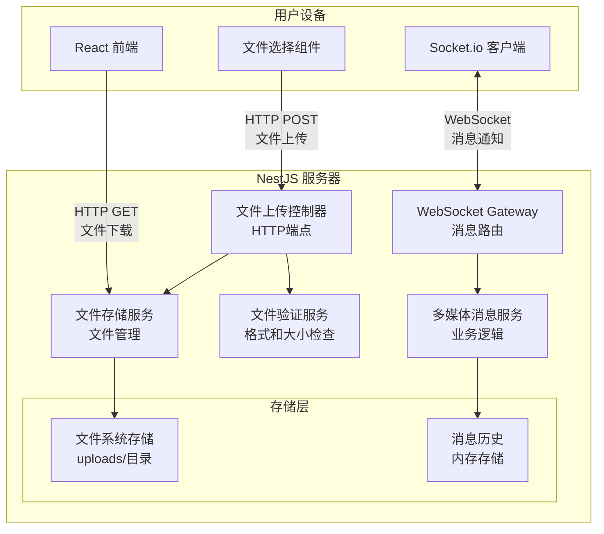
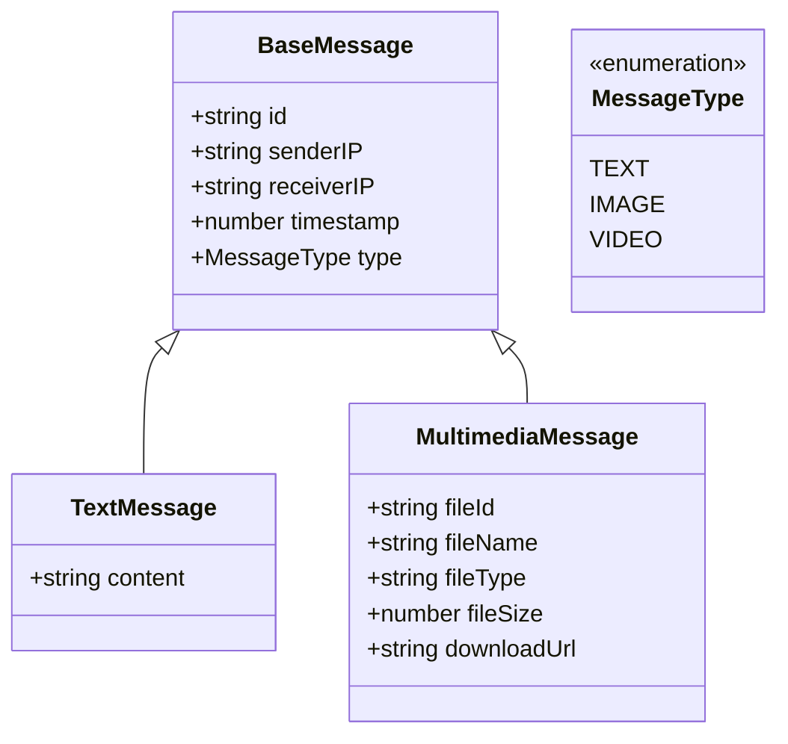

# 多媒体消息功能设计文档

## 概述

多媒体消息功能是对现有局域网消息应用的扩展，允许用户通过简单的文件选择界面发送和接收图片和视频文件。该功能采用简化设计，专注于核心功能实现，避免复杂的预览和拖拽功能。

### 核心功能

- 文件选择按钮界面（支持图片和视频）
- 基本文件验证（格式、大小限制10MB）
- 文件存储和唯一标识生成
- 聊天界面中的文件显示（文件名 + 下载链接）
- WebSocket实时传输多媒体消息
- 与现有文本消息系统的无缝集成

### 技术栈扩展

基于现有技术栈：
- **前端**: React + TypeScript + Tailwind CSS
- **后端**: NestJS + TypeScript + Socket.io
- **新增**: 文件上传处理、文件存储、多媒体消息类型

### 设计原则

1. **简化优先**: 避免复杂功能，专注核心文件传输
2. **向后兼容**: 与现有消息系统完全兼容
3. **渐进增强**: 在现有架构基础上扩展
4. **用户友好**: 清晰的文件状态反馈和错误提示
5. **安全性**: 严格的文件验证和大小限制

## 架构

### 系统架构扩展



### 文件处理流程


### 消息类型扩展



## 组件和接口

### 前端组件扩展

#### 1. FileSelector 组件

文件选择和上传组件，集成到现有 MessageInput 中。

```typescript
interface FileSelectorProps {
  onFileSelected: (file: File) => Promise<void>;
  isUploading: boolean;
  disabled: boolean;
  acceptedTypes: string[];
  maxFileSize: number;
}

interface FileValidationResult {
  isValid: boolean;
  error?: string;
}
```

#### 2. MultimediaMessage 组件

显示多媒体消息的组件。

```typescript
interface MultimediaMessageProps {
  message: MultimediaMessage;
  isOwnMessage: boolean;
  onDownload: (fileId: string, fileName: string) => void;
}

interface MultimediaMessage extends BaseMessage {
  fileId: string;
  fileName: string;
  fileType: 'image' | 'video';
  fileSize: number;
  downloadUrl: string;
}
```

#### 3. MessageInput 组件扩展

扩展现有组件以支持文件选择。

```typescript
interface MessageInputProps {
  // 现有属性
  onSendMessage: (targetUserIP: string, content: string) => Promise<void>;
  onlineUsers: User[];
  isConnected: boolean;
  
  // 新增属性
  onSendMultimediaMessage: (targetUserIP: string, file: File) => Promise<void>;
  isFileUploading: boolean;
}
```

### 后端 NestJS 扩展

#### 1. File Upload Controller

处理文件上传的HTTP控制器。

```typescript
@Controller('files')
export class FileUploadController {
  constructor(
    private readonly fileValidationService: FileValidationService,
    private readonly fileStorageService: FileStorageService,
  ) {}

  @Post('upload')
  @UseInterceptors(FileInterceptor('file'))
  async uploadFile(
    @UploadedFile() file: Express.Multer.File,
    @Body() uploadDto: FileUploadDto,
  ): Promise<FileUploadResponse>;

  @Get(':fileId')
  async downloadFile(
    @Param('fileId') fileId: string,
    @Res() response: Response,
  ): Promise<void>;

  @Get(':fileId/info')
  async getFileInfo(
    @Param('fileId') fileId: string,
  ): Promise<FileInfoResponse>;
}
```

#### 2. File Validation Service

文件验证服务。

```typescript
@Injectable()
export class FileValidationService {
  private readonly SUPPORTED_IMAGE_FORMATS = ['jpg', 'jpeg', 'png', 'gif'];
  private readonly SUPPORTED_VIDEO_FORMATS = ['mp4', 'mov'];
  private readonly MAX_FILE_SIZE = 10 * 1024 * 1024; // 10MB

  validateFile(file: Express.Multer.File): ValidationResult;
  validateFileExtension(fileName: string): ValidationResult;
  validateFileSize(fileSize: number): ValidationResult;
  getFileType(fileName: string): 'image' | 'video' | 'unknown';
  isImageFile(fileName: string): boolean;
  isVideoFile(fileName: string): boolean;
}
```

#### 3. File Storage Service

文件存储管理服务。

```typescript
@Injectable()
export class FileStorageService {
  private readonly UPLOAD_DIR = './uploads';

  constructor() {
    this.ensureUploadDirectory();
  }

  async storeFile(file: Express.Multer.File): Promise<StoredFileInfo>;
  async getFile(fileId: string): Promise<StoredFileInfo | null>;
  async getFileStream(fileId: string): Promise<ReadStream>;
  async deleteFile(fileId: string): Promise<boolean>;
  generateFileId(): string;
  getFilePath(fileId: string): string;
  ensureUploadDirectory(): void;
  cleanupOldFiles(maxAgeMs: number): Promise<number>;
}
```

#### 4. Multimedia Message Service

多媒体消息业务逻辑服务。

```typescript
@Injectable()
export class MultimediaMessageService {
  constructor(
    private readonly messageRepository: MessageRepository,
    private readonly fileStorageService: FileStorageService,
  ) {}

  createMultimediaMessage(
    senderIP: string,
    receiverIP: string,
    fileInfo: StoredFileInfo,
  ): MultimediaMessage;

  getMultimediaMessage(messageId: string): Promise<MultimediaMessage | null>;
  
  generateDownloadUrl(fileId: string): string;
  
  validateMultimediaMessageRequest(
    dto: SendMultimediaMessageDto,
  ): ValidationResult;
}
```

#### 5. WebSocket Gateway 扩展

扩展现有 Gateway 以支持多媒体消息。

```typescript
@WebSocketGateway()
export class MessagingGateway {
  // 现有方法...

  @SubscribeMessage('sendMultimediaMessage')
  async handleSendMultimediaMessage(
    @ConnectedSocket() client: Socket,
    @MessageBody() payload: SendMultimediaMessageDto,
  ): Promise<WsResponse<MultimediaMessageResponse>>;

  private sendMultimediaMessageToUser(
    targetSocketId: string,
    message: MultimediaMessage,
  ): void;
}
```

### 数据传输对象 (DTOs)

#### 文件上传相关

```typescript
interface FileUploadDto {
  targetUserIP: string;
}

interface FileUploadResponse {
  success: boolean;
  fileId?: string;
  fileName?: string;
  fileSize?: number;
  fileType?: 'image' | 'video';
  error?: string;
}

interface SendMultimediaMessageDto {
  targetIP: string;
  fileId: string;
}

interface MultimediaMessageResponse {
  success: boolean;
  message?: MultimediaMessage;
  error?: string;
}

interface FileInfoResponse {
  fileId: string;
  fileName: string;
  fileType: 'image' | 'video';
  fileSize: number;
  uploadedAt: number;
}

interface StoredFileInfo {
  fileId: string;
  originalName: string;
  fileName: string;
  filePath: string;
  fileSize: number;
  mimeType: string;
  uploadedAt: number;
}
```

### WebSocket 事件扩展

#### 新增客户端事件

```typescript
// 发送多媒体消息
interface SendMultimediaMessageEvent {
  targetIP: string;
  fileId: string;
}
```

#### 新增服务器事件

```typescript
// 新多媒体消息通知
interface NewMultimediaMessageEvent {
  message: MultimediaMessage;
}

// 多媒体消息发送成功
interface MultimediaMessageSentEvent {
  message: MultimediaMessage;
}

// 文件上传进度（可选）
interface FileUploadProgressEvent {
  fileId: string;
  progress: number; // 0-100
}
```

## 数据模型

### 扩展消息模型

```typescript
// 基础消息接口
interface BaseMessage {
  id: string;
  senderIP: string;
  receiverIP: string;
  timestamp: number;
  type: MessageType;
  status: 'pending' | 'sent' | 'failed';
}

// 消息类型枚举
enum MessageType {
  TEXT = 'text',
  IMAGE = 'image',
  VIDEO = 'video',
}

// 文本消息（现有）
interface TextMessage extends BaseMessage {
  type: MessageType.TEXT;
  content: string;
}

// 多媒体消息（新增）
interface MultimediaMessage extends BaseMessage {
  type: MessageType.IMAGE | MessageType.VIDEO;
  fileId: string;
  fileName: string;
  fileSize: number;
  downloadUrl: string;
}

// 统一消息类型
type Message = TextMessage | MultimediaMessage;
```

### 文件存储模型

```typescript
interface StoredFile {
  fileId: string;           // 唯一文件标识符
  originalName: string;     // 原始文件名
  storedName: string;       // 存储文件名（包含扩展名）
  filePath: string;         // 完整文件路径
  fileSize: number;         // 文件大小（字节）
  mimeType: string;         // MIME类型
  fileType: 'image' | 'video'; // 文件类型分类
  uploadedAt: number;       // 上传时间戳
  uploadedBy: string;       // 上传者IP
}
```

### 文件验证配置

```typescript
interface FileValidationConfig {
  maxFileSize: number;                    // 最大文件大小（字节）
  supportedImageFormats: string[];        // 支持的图片格式
  supportedVideoFormats: string[];        // 支持的视频格式
  allowedMimeTypes: string[];            // 允许的MIME类型
}

const DEFAULT_FILE_CONFIG: FileValidationConfig = {
  maxFileSize: 10 * 1024 * 1024,         // 10MB
  supportedImageFormats: ['jpg', 'jpeg', 'png', 'gif'],
  supportedVideoFormats: ['mp4', 'mov'],
  allowedMimeTypes: [
    'image/jpeg',
    'image/png', 
    'image/gif',
    'video/mp4',
    'video/quicktime',
  ],
};
```

### 上传状态模型

```typescript
interface FileUploadState {
  isUploading: boolean;
  progress: number;         // 0-100
  error?: string;
  uploadedFile?: {
    fileId: string;
    fileName: string;
    fileSize: number;
  };
}
```

## 正确性属性

*属性是系统所有有效执行中应该保持为真的特征或行为——本质上是关于系统应该做什么的形式化陈述。属性是人类可读规范和机器可验证正确性保证之间的桥梁。*

### 属性反思

在分析接受标准后，我识别出以下可能的冗余：
- 属性1.3和1.4（支持的图片/视频格式验证）可以合并为一个综合的文件格式验证属性
- 属性2.1和2.3（格式验证和拒绝不支持格式）实际上是同一个验证过程的两面
- 属性4.1、4.3和4.5（显示文件名、类型和大小）可以合并为一个综合的文件信息显示属性
- 属性5.1和5.3（WebSocket广播和消息载荷）可以合并为一个完整的消息传输属性

经过反思，以下是去除冗余后的核心属性：

### 属性 1: 文件格式验证

*对于任意*文件，文件验证器应该接受所有支持的图片格式（JPG、PNG、GIF）和视频格式（MP4、MOV），并拒绝所有其他格式

**验证需求: 1.3, 1.4, 2.1, 2.3**

### 属性 2: 文件大小限制

*对于任意*文件，当文件大小超过10MB限制时，文件验证器应该拒绝该文件并显示错误消息

**验证需求: 2.2**

### 属性 3: 多文件处理一致性

*对于任意*多文件选择操作，每个文件都应该经过相同的验证和处理流程，验证结果应该独立

**验证需求: 1.5**

### 属性 4: 验证失败阻止处理

*对于任意*验证失败的文件，系统应该阻止该文件进入后续处理流程（存储、发送等）

**验证需求: 2.5**

### 属性 5: 文件存储唯一性

*对于任意*有效文件，存储服务应该为其生成唯一标识符，并创建可访问的文件路径

**验证需求: 3.1, 3.2**

### 属性 6: 原始文件名保持

*对于任意*存储的文件，系统应该保持其原始文件名以供用户参考

**验证需求: 3.4**

### 属性 7: 多媒体消息完整性

*对于任意*多媒体消息，该消息应该包含有效的文件引用、原始文件名和文件类型信息

**验证需求: 3.3, 4.1, 4.3, 4.5**

### 属性 8: 下载链接可用性

*对于任意*多媒体消息，系统应该为其提供有效的下载链接，点击后能够成功下载文件

**验证需求: 4.2, 4.4**

### 属性 9: WebSocket消息广播完整性

*对于任意*发送的多媒体消息，系统应该通过WebSocket向所有连接用户广播包含文件名和文件引用的完整消息载荷

**验证需求: 5.1, 5.3**

### 属性 10: 实时消息显示

*对于任意*通过WebSocket接收的多媒体消息，消息显示组件应该立即显示该消息

**验证需求: 5.2**

### 属性 11: 消息历史加载

*对于任意*新加入聊天的用户，系统应该加载并显示最近的多媒体消息历史

**验证需求: 5.4**

### 属性 12: 文件存储往返一致性

*对于任意*有效文件，存储后再检索应该得到相同的文件内容和元数据

**验证需求: 数据完整性（隐含）**

## 错误处理

### 错误类型和处理策略

#### 1. 文件选择和验证错误

**错误场景:**
- 选择不支持的文件格式
- 文件大小超过10MB限制
- 文件读取失败
- 文件损坏或无效

**处理策略:**
- 在客户端进行即时验证（实时反馈）
- 显示具体的错误信息（格式不支持、文件过大等）
- 阻止无效文件进入上传流程
- 允许用户重新选择文件
- 保持其他功能正常运行

**实现位置:**
- 前端: FileSelector组件的验证逻辑
- 后端: FileValidationService

#### 2. 文件上传错误

**错误场景:**
- 网络连接中断
- 服务器存储空间不足
- 上传超时（30秒）
- 服务器内部错误

**处理策略:**
- 显示上传进度和状态
- 提供重试机制（最多3次）
- 显示具体的错误信息
- 在上传失败时清理临时文件
- 记录错误日志用于调试

**实现位置:**
- 前端: 文件上传处理函数
- 后端: FileUploadController

#### 3. 文件存储错误

**错误场景:**
- 磁盘空间不足
- 文件系统权限问题
- 文件路径冲突
- 存储服务不可用

**处理策略:**
- 检查存储空间和权限
- 生成唯一文件名避免冲突
- 提供降级存储方案（如果适用）
- 向用户显示友好的错误信息
- 记录详细错误信息

**实现位置:**
- 后端: FileStorageService
- 后端: 存储健康检查中间件

#### 4. 文件下载错误

**错误场景:**
- 文件不存在或已删除
- 文件访问权限问题
- 网络传输中断
- 文件损坏

**处理策略:**
- 验证文件存在性
- 提供文件完整性检查
- 支持断点续传（可选）
- 显示下载进度和状态
- 提供重新下载选项

**实现位置:**
- 后端: FileUploadController的下载端点
- 前端: 下载处理逻辑

#### 5. WebSocket传输错误

**错误场景:**
- WebSocket连接断开
- 消息传输失败
- 消息格式错误
- 目标用户离线

**处理策略:**
- 检测连接状态
- 自动重连机制
- 消息队列缓存（离线消息）
- 显示消息发送状态
- 提供手动重发选项

**实现位置:**
- 前端: WebSocket客户端管理
- 后端: MessagingGateway错误处理

#### 6. 存储空间管理错误

**错误场景:**
- 存储空间接近满载
- 文件清理失败
- 存储配额超限

**处理策略:**
- 监控存储空间使用
- 自动清理过期文件
- 设置存储配额警告
- 阻止新文件上传当空间不足
- 通知管理员存储问题

**实现位置:**
- 后端: 存储监控服务
- 后端: 定时清理任务

### 错误响应格式

所有错误响应遵循统一格式：

```typescript
interface MultimediaErrorResponse {
  success: false;
  error: {
    code: MultimediaErrorCode;
    message: string;
    details?: {
      fileName?: string;
      fileSize?: number;
      maxSize?: number;
      supportedFormats?: string[];
    };
    timestamp: number;
  };
}
```

### 错误代码定义

```typescript
enum MultimediaErrorCode {
  // 文件验证错误
  UNSUPPORTED_FORMAT = 'UNSUPPORTED_FORMAT',
  FILE_TOO_LARGE = 'FILE_TOO_LARGE',
  FILE_CORRUPTED = 'FILE_CORRUPTED',
  FILE_READ_ERROR = 'FILE_READ_ERROR',
  
  // 上传错误
  UPLOAD_FAILED = 'UPLOAD_FAILED',
  UPLOAD_TIMEOUT = 'UPLOAD_TIMEOUT',
  NETWORK_ERROR = 'NETWORK_ERROR',
  
  // 存储错误
  STORAGE_FULL = 'STORAGE_FULL',
  STORAGE_ERROR = 'STORAGE_ERROR',
  FILE_NOT_FOUND = 'FILE_NOT_FOUND',
  ACCESS_DENIED = 'ACCESS_DENIED',
  
  // 传输错误
  SEND_FAILED = 'SEND_FAILED',
  USER_OFFLINE = 'USER_OFFLINE',
  MESSAGE_TOO_LARGE = 'MESSAGE_TOO_LARGE',
  
  // 系统错误
  INTERNAL_ERROR = 'INTERNAL_ERROR',
  SERVICE_UNAVAILABLE = 'SERVICE_UNAVAILABLE',
}
```

## 测试策略

### 测试方法概述

本多媒体消息功能采用双重测试方法，结合单元测试和基于属性的测试（Property-Based Testing, PBT），确保文件处理和消息传输的正确性。

#### 单元测试
- 验证特定文件格式和大小的处理
- 测试文件上传和下载的边缘情况
- 测试错误处理和用户反馈
- 使用Jest和React Testing Library

#### 基于属性的测试
- 验证跨所有文件类型和大小的通用属性
- 通过随机文件生成实现全面覆盖
- 使用fast-check库进行属性测试
- 每个属性测试最少运行100次迭代

### 后端测试策略

#### 1. FileValidationService测试

**单元测试:**
- 测试支持格式的具体示例（JPG、PNG、GIF、MP4、MOV）
- 测试不支持格式的拒绝（TXT、EXE、PDF等）
- 测试边界大小文件（9.9MB、10MB、10.1MB）
- 测试空文件和损坏文件

**属性测试:**
- 属性1: 文件格式验证
- 属性2: 文件大小限制

```typescript
/**
 * Feature: multimedia-messaging, Property 1: 文件格式验证
 * 
 * 对于任意文件，文件验证器应该接受所有支持的图片格式和视频格式，
 * 并拒绝所有其他格式
 */
```

#### 2. FileStorageService测试

**单元测试:**
- 测试文件存储和检索
- 测试唯一ID生成
- 测试文件路径创建
- 测试存储空间检查

**属性测试:**
- 属性5: 文件存储唯一性
- 属性6: 原始文件名保持
- 属性12: 文件存储往返一致性

#### 3. FileUploadController测试

**单元测试:**
- 测试成功上传流程
- 测试各种错误场景
- 测试文件下载端点
- 测试并发上传

**属性测试:**
- 属性4: 验证失败阻止处理

#### 4. MultimediaMessageService测试

**单元测试:**
- 测试消息创建
- 测试下载URL生成
- 测试消息验证

**属性测试:**
- 属性7: 多媒体消息完整性
- 属性8: 下载链接可用性

### 前端测试策略

#### 1. FileSelector组件测试

**单元测试:**
- 测试文件选择按钮渲染
- 测试文件选择对话框触发
- 测试文件验证反馈
- 测试上传进度显示

**属性测试:**
- 属性3: 多文件处理一致性

#### 2. MultimediaMessage组件测试

**单元测试:**
- 测试消息渲染
- 测试下载链接点击
- 测试文件信息显示
- 测试错误状态显示

**属性测试:**
- 属性7: 多媒体消息完整性
- 属性8: 下载链接可用性

#### 3. WebSocket集成测试

**单元测试:**
- 测试消息发送和接收
- 测试连接错误处理
- 测试消息历史加载

**属性测试:**
- 属性9: WebSocket消息广播完整性
- 属性10: 实时消息显示
- 属性11: 消息历史加载

### 集成测试

#### 端到端文件传输测试

**测试场景:**
1. 用户A选择图片 -> 验证通过 -> 上传成功 -> 发送消息 -> 用户B接收并下载
2. 用户选择过大文件 -> 验证失败 -> 显示错误 -> 用户重新选择
3. 网络中断 -> 上传失败 -> 自动重试 -> 最终成功
4. 多用户同时上传文件 -> 并发处理 -> 所有文件成功处理

**测试工具:**
- Supertest（API测试）
- Socket.io-client（WebSocket测试）
- 文件生成工具（测试数据）

### 基于属性的测试配置

#### 文件生成器

```typescript
// 支持格式文件生成器
const supportedFileArbitrary = fc.oneof(
  fc.record({
    name: fc.string().map(s => `${s}.jpg`),
    type: fc.constant('image/jpeg'),
    size: fc.integer({ min: 1, max: 10 * 1024 * 1024 }),
  }),
  fc.record({
    name: fc.string().map(s => `${s}.png`),
    type: fc.constant('image/png'),
    size: fc.integer({ min: 1, max: 10 * 1024 * 1024 }),
  }),
  fc.record({
    name: fc.string().map(s => `${s}.mp4`),
    type: fc.constant('video/mp4'),
    size: fc.integer({ min: 1, max: 10 * 1024 * 1024 }),
  }),
);

// 不支持格式文件生成器
const unsupportedFileArbitrary = fc.record({
  name: fc.oneof(
    fc.string().map(s => `${s}.txt`),
    fc.string().map(s => `${s}.pdf`),
    fc.string().map(s => `${s}.exe`),
  ),
  type: fc.oneof(
    fc.constant('text/plain'),
    fc.constant('application/pdf'),
    fc.constant('application/octet-stream'),
  ),
  size: fc.integer({ min: 1, max: 100 * 1024 * 1024 }),
});
```

#### 测试配置

```typescript
const multimediaTestConfig = {
  numRuns: 100,
  verbose: true,
  seed: Date.now(),
  timeout: 10000, // 文件操作可能需要更长时间
};
```

### 性能测试

#### 文件处理性能

- 测试大文件（接近10MB）的处理时间
- 测试并发文件上传性能
- 测试存储空间使用效率
- 测试下载速度和带宽使用

#### 内存使用测试

- 监控文件处理时的内存使用
- 测试大量文件存储的内存影响
- 验证文件流处理不会导致内存泄漏

### 测试覆盖率目标

- 文件验证逻辑: 100%
- 文件存储服务: ≥ 90%
- 多媒体消息处理: ≥ 85%
- 前端组件: ≥ 80%
- 集成测试: 覆盖所有主要用户流程

### 测试执行命令

```bash
# 后端多媒体功能测试
npm run test:multimedia          # 运行多媒体相关测试
npm run test:files              # 运行文件处理测试
npm run test:integration        # 运行集成测试

# 前端多媒体组件测试
npm run test:components         # 运行组件测试
npm run test:multimedia-ui      # 运行多媒体UI测试

# 性能测试
npm run test:performance        # 运行性能测试
npm run test:load              # 运行负载测试
```